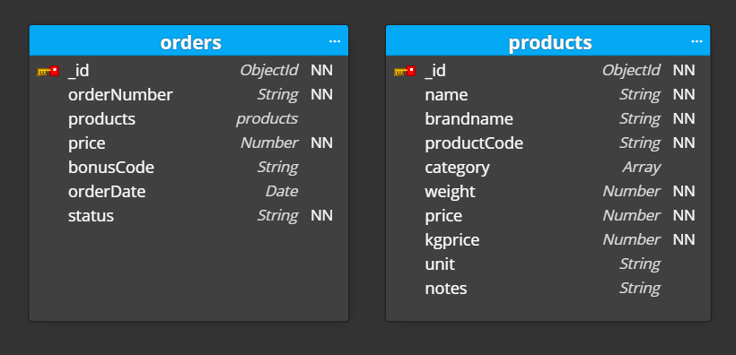
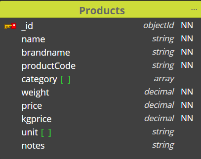
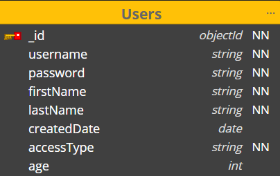
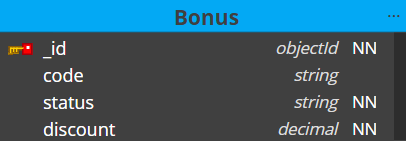

### [ :information_source: Link: Iseseiseva töö ülesande kirjeldus](./assingment_description.md)
________________________________________________________________________________________________________________________________________________________________________________

# :memo: Projekt: SALVEST 
## Projekti omanik: tiim TARTU
## Tiim TARTU liikmed
| Grupiliikme nimi | github kasutaja |
| --- | --- |
| :green_book: Airika Vettik | AirikaVettik |
| :closed_book: Ilja Akulenko | akulenkoilja |
| :green_book: Ingri Jufkin | IngridJufkin |
| :green_book: Kevin-Anders Kalamees | Kevinanders0 |
| :green_book: Ragne Samson | ragne989 |
| :green_book: Vaire Riiet | Vaire444 |

:green_book: - aktiivne osaleja

:closed_book: - mitteaktiivne osaleja

________________________________________________________________________________________________________________________________________________________________________________

## Projekti kirjeldus

________________________________________________________________________________________________________________________________________________________________________________
## Konfiguratsioon
Kasutatakse järgmisi lühendeid:
NN - tähistab nõutavat välja (not null)

### Schema Orders koos child schema-ga Product

#### Orders endpoint-id
* Tellimuse lisamine - `addOrder`
* Kõikide telimuste leidmine - `getAllOrders`
* Tellimuse leidmine tellimuse ID järgi - `getOrderByID`
* Tellimuse leidmine kuupäeva järgi - `getOrdersByDate`
* Tellimuse leidmine staatuse järgi - `getOrdersByStatus`
* Tellimuse muutmine - `updateOrder`
* Tellimuses toote muutmine toote ID-järgi - `updateOrderProduct`

### Schema Products

#### Products endpoint-id
* Toote lisamine -`addProduct`
* Kõikide toodete leidmine - `getAllProducts`
* Toote muutmine - `updateProduct`
* Toote leidmine ID järgi - `getProductByID`
* Toote kustutamine - `deleteProduct`

### Schema Users

#### Users endpoint-id:
* Kasutaja lisamine - `addUser`
* Kõkide kasutajate leidmine - `getAllUsers`
* Kasutaja muutmine - `updateUser`

### Schema Bonus

#### Bonus endpointid:
* Boonuse lisamine - `addBonus`
* Kõikide boonuste leidmine - `getAllBonus`
* Boonuse muutmine - `updateBonus`

