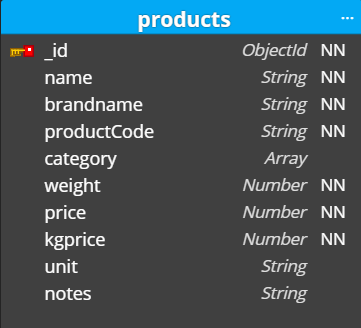
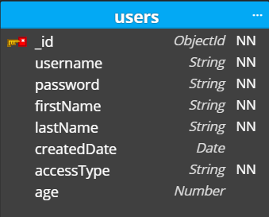
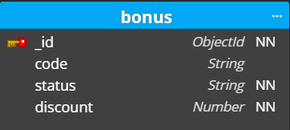
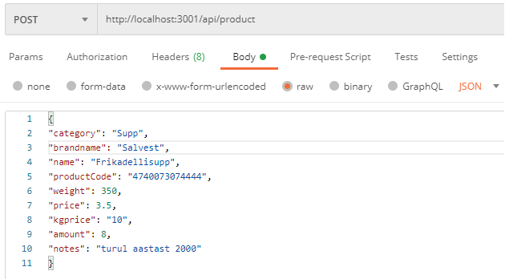
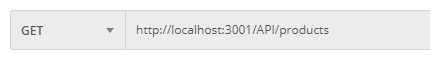
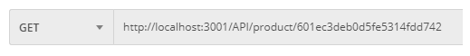
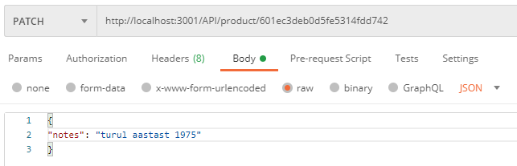
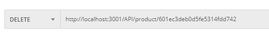
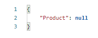

### [ :information_source: Link: Iseseiseva töö ülesande kirjeldus](./assingment_description.md)
________________________________________________________________________________________________________________________________________________________________________________

# :memo: Projekt: SALVEST 
## Projekti omanik: grupp TARTU
## Grupp TARTU liikmed:
| Grupiliikme nimi | github kasutaja |
| --- | --- |
| :green_book: Airika Vettik | AirikaVettik |
| :closed_book: Ilja Akulenko | akulenkoilja |
| :green_book: Ingri Jufkin | IngridJufkin |
| :green_book: Kevin-Anders Kalamees | Kevinanders0 |
| :green_book: Ragne Samson | ragne989 |
| :green_book: Vaire Riiet | Vaire444 |

:green_book: - aktiivne osaleja

:closed_book: - mitteaktiivne osaleja

________________________________________________________________________________________________________________________________________________________________________________

# Projekti kirjeldus

## ???

________________________________________________________________________________________________________________________________________________________________________________
# Konfiguratsioon
Kasutatakse järgmisi lühendeid:
NN - tähistab nõutavat välja (not null)

## Schema Orders koos child schema-ga Products

### Orders endpoint-id
* Tellimuse lisamine - `addOrder`
* Kõikide telimuste leidmine - `getAllOrders`
* Tellimuse leidmine tellimuse ID järgi - `getOrderByID`
* Tellimuse leidmine kuupäeva järgi - `getOrdersByDate`
* Tellimuse leidmine staatuse järgi - `getOrdersByStatus`
* Tellimuse muutmine - `updateOrder`
* Tellimuses toote muutmine toote ID-järgi - `updateOrderProduct`
________________________________________________________________________________________________________________________________________________________________________________
## Schema Products

### Products endpoint-id
* Toote lisamine -`addProduct`
* Kõikide toodete leidmine - `getAllProducts`
* Toote muutmine - `updateProduct`
* Toote leidmine ID järgi - `getProductByID`
* Toote kustutamine - `deleteProduct`
________________________________________________________________________________________________________________________________________________________________________________
## Schema Users

### Users endpoint-id:
* Kasutaja lisamine - `addUser`
* Kõkide kasutajate leidmine - `getAllUsers`
* Kasutaja muutmine - `updateUser`
________________________________________________________________________________________________________________________________________________________________________________
## Schema Bonus

### Bonus endpointid:
* Boonuse lisamine - `addBonus`
* Kõikide boonuste leidmine - `getAllBonus`
* Boonuse muutmine - `updateBonus`
________________________________________________________________________________________________________________________________________________________________________________
# Postmanis POST, GET, PATCH ja DELETE
## (POST) Toote andmebaasi lisamine
- Andmebaasi lisamiseks kasutatakse POST meetodit
- Selleks avame uue päringu Tabi
- Valime päringu tüübiks POST
- Sisestame päringu URL-i. Meie näites server jookseb aadressil `http://localhost:3001`+ `/api` + `/product` (viimane osa kirjeldatud router.js failis).
- Seejärel valida Body -> raw -> faili tüübiks JSON
- Edasi tuleb body-sse sisestada sisestatavad andmed, kui need lisatud, siis saata päring ("Send" nupp)
- Kui päring õnnestub, on toode lisatud, Kontrollimiseks saad kasutada GET meetodit ja vaadata, kas lisatud toode on loendis olemas

## (GET) andmebaasist kõikide toodete otsimine
- Kõikide toodete otsimiseks kasutatame GET päringut
- url `http://localhost:3001/API/products`
- saata päring ("Send" nupp)

## (GET) andmebaasist toote otsimine ID järgi
- Toote otsimiseks ID järgi kasutame samuti GET päringut
- url `http://localhost:3001/API/product/:id` (`:id` asendada otsitava toote ID-ga)
- saata päring ("Send" nupp)

## (PATCH) ühe toote muutmine
- Muutmiseks kasutatakse PATCH meetodit
- Selleks avame uue päringu Tabi
- Valime päringu tüübiks PATCH
- Sisestame päringu URL-i. `http://localhost:3001/API/product/:id` (`:id`asendame selle toote ID-ga, mida muuta soovime)
- Seejärel valida Body -> raw -> faili tüübiks JSON
- Edasi tuleb body-sse sisestada muudetavad andmed, kui need lisatud, siis saata päring ("Send" nupp)
- Kui päring õnnestub, on muudatus tehtud. Kontrollimiseks saad kasutada GET meetodit ja otsida ID-ga toode üles

## (DELETE) ühe toote kustutamine
- Kustutamiseks kasutatakse DELETE meetodit
- Selleks avame uue päringu Tabi
- Valime päringu tüübiks DELETE
- Sisestame päringu URL-i. `http://localhost:3001/API/product/:id` (`:id`asendame selle toote ID-ga, mida kustutada soovime)
- saata päring ("Send" nupp)

- Kui päring õnnestub, on toode kustutatud. Kontrollimiseks saad kasutada GET meetodit. 
- Kui toodet ei leita tagastab vastuseks

